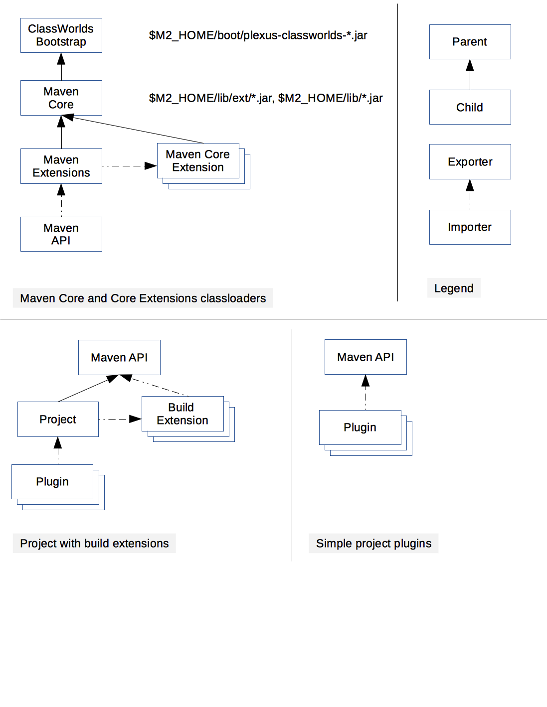
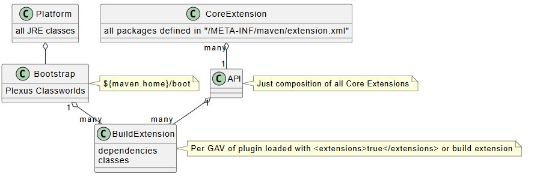
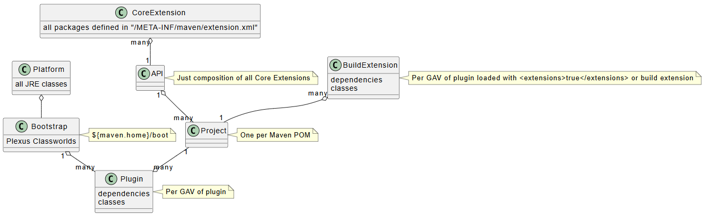

<!--
Licensed to the Apache Software Foundation (ASF) under one
or more contributor license agreements.  See the NOTICE file
distributed with this work for additional information
regarding copyright ownership.  The ASF licenses this file
to you under the Apache License, Version 2.0 (the
"License"); you may not use this file except in compliance
with the License.  You may obtain a copy of the License at

http://www.apache.org/licenses/LICENSE-2.0

Unless required by applicable law or agreed to in writing,
software distributed under the License is distributed on an
"AS IS" BASIS, WITHOUT WARRANTIES OR CONDITIONS OF ANY
KIND, either express or implied.  See the License for the
specific language governing permissions and limitations
under the License.
-->

# Guide to Maven Classloading

This is a description of the classloader hierarchy in Maven.


<!-- MACRO{toc|section=1|fromDepth=2} -->

## Overview

Maven uses the [Plexus Classworlds](https://codehaus-plexus.github.io/plexus-classworlds/) classloading framework to create the classloader graph. If you look in your `${maven.home}/boot` directory, you will see a single JAR which is the Classworlds JAR we use to boot the classloader graph. The Classworlds JAR is the only element of the Java `CLASSPATH`. The other classloaders are built by Classworlds ("realms" in Classworlds terminology).

Each realm exposes

1. optionally some classes imported from 0..n other classloaders
2. optionally some classes from a directory or JAR
3. one parent classloader

The search order is always as given above.

## Platform Classloader

This is the classloader exposing all JRE classes.

During normal command line Maven invocation, the ClassWorlds bootstrap classloader is the JVM System
classloader and contains classes from `${maven.home}/boot/plexus-classworlds-*.jar` and classes
from `-javaagent`.

## System Classloader

It contains only Plexus Classworlds and imports the platform classloader.

## Core Classloader

The second classloader down the graph contains the core requirements of Maven. **It is used by Maven internally but not by plugins**. The core classloader has the libraries in `${maven.home}/lib`. In general these are just Maven libraries. For example instances of [`MavenProject`](/ref/current/apidocs/org/apache/maven/project/MavenProject.html) belong to this classloader.

Contents of this classloader are configured in `${maven.home}/bin/m2.conf` and typically contains `${maven.home}/lib/ext/*.jar` and `${maven.home}/lib/*.jar`.

You can add elements to this classloader by the means outlined in [Core Extension](./guide-using-extensions.html). These are loaded through the same classloader as `${maven.home}/lib` and hence are available to the Maven core and all plugins for the current project (through the API Classloader, see next paragraph). More information is available in [Core Extension](./guide-using-extensions.html).

## Core Extensions

Core Extensions is a mechanism introduced in Maven 3.3.0 which allows additional components to be loaded into Maven Core as part of a build session.

Each core extension is loaded in a separate classloader and there is no mechanism to share classes among core extensions. Core extension classloaders use Maven Core classloader as the parent and have access to both exported and internal Maven Core classes.

A core extension can use a `META-INF/maven/extension.xml` descriptor to declare packages and artifacts exported by the extension. If the descriptor is not present, no packages or artifacts are exported, but the extension can still contribute components to Maven Core extension points.

Core extensions are configured in the `.mvn/extensions.xml` configuration file at the project's top level:

```xml
<?xml version="1.0" encoding="UTF-8"?>
<extensions>
  <extension>
    <groupId>...</groupId>
    <artifactId>...</artifactId>
    <version>...</version>
  </extension>
  <extension>...</extension>
  ...
</extensions>
```

Core extensions are loaded as part of Maven runtime startup and disposed of as part of Maven runtime shutdown.

## Maven Extensions Classloader

The Maven Extensions classloader aggregates packages exported by all core extension realms. It also loads additional classpath entries specified via the `-Dmaven.ext.class.path` command line parameter.

This classloader is created only when core extensions are configured for the build. If created, it will be set as the "container realm" in the Plexus container instance (replacing the Core Classloader in that role).

## API Classloader

The API classloader aggregates exported packages from both the Maven Core classloader and any Maven Core Extensions classloaders. It does not include any classes directly.

This has been introduced with Maven 3.3.1 ([MNG-5771](https://issues.apache.org/jira/browse/MNG-5771)). The main API is listed in [Maven Core Extensions Reference](/ref/current/maven-core/core-extensions.html).

The Maven API classloader uses the approximate JVM Bootstrap classloader as its parent (there is no public API to access the JVM Bootstrap classloader; the implementation uses `ClassLoader.getSystemClassLoader().getParent()`). This parent does not contain any application or javaagent classes, which allows for a consistent Maven API classpath regardless of how the Maven JVM was launched.

## Build Extension Classloaders



For every plugin which is marked with `<extensions>true</extensions>` and every [build extension](/ref/current/maven-model/maven.html#class_extension) listed in the according section of the POM, there is a dedicated classloader. Those are isolated. That is, one build extension does not have access to other build extensions. It imports everything from the API classloader. All JSR 330 or Plexus components declared in the underlying JAR are registered in the global Plexus container while creating the classloader. In addition all component references in the plugin descriptor are properly wired from the underlying Plexus container. Build extensions have limited effect as they are loaded late.

Modern Maven 3.x build extensions are those that either consist of multiple artifacts or include a `META-INF/maven/extension.xml` descriptor. Each such extension is loaded in a fully isolated classloader — it is not possible to share classes or inject components among extensions. Build extension classloaders use the ClassWorlds bootstrap classloader as the parent, which allows build extensions access to `-javaagent` classes.

Maven guarantees that each distinct modern build extension (as identified by groupId, artifactId, version and set of dependencies) is loaded by one and only one extension classloader, and that classloader is wired to all projects that use the extension.

## Project Classloaders

There is one project classloader per Maven project (identified through its coordinates). This one imports the API Classloader. In addition it exposes all classes from all Build Extension Classloaders which are bound to the current project. This is only released with the container. During the build outside Mojo executions, the thread's context classloader is set to the project classloader.

Legacy Maven 2.x build extensions (i.e. extensions that consist of a single artifact which does not include a `META-INF/maven/extension.xml` descriptor) are loaded directly into the project classloader rather than a separate extension classloader.

Maven guarantees there will be one and only one project classloader for each unique set of project build extensions, and the same classloader will be used by all projects that have that set of build extensions.

## Plugin Classloaders



Each plugin (which is not marked as build extension) has its own classloader that imports the Project classloader.

Plugins marked with `<extensions>true</extensions>` leverage the Build Extension classloader instead of the Plugin classloader.

Plugin classloaders are wired differently depending on whether the project uses build extensions:

- **Without build extensions**: a single classloader is created for each plugin identified by `groupId:artifactId:version`, importing API packages from the Maven API classloader. Maven will create one and only one classloader for each unique plugin+dependency combination.

- **With build extensions**: plugin classloaders are wired to project classloaders, giving plugin code access to both Maven API packages and packages exported by the project build extensions. Maven will create one and only one classloader for each unique plugin+dependencies+build-extensions combination.

All plugin classloaders use the ClassWorlds bootstrap classloader as the parent. This provides a relatively clean and therefore consistent plugin classpath, while still allowing plugins access to `-javaagent` classes (see [MNG-4747](https://issues.apache.org/jira/browse/MNG-4747)).

Note: Reporting plugins are wired differently and are outside the scope of this document.

Users can add dependencies to this classloader by adding dependencies to a plugin in the [`plugins/plugin`](/ref/current/maven-model/maven.html#class_plugin) section of their project `pom.xml`. Here is a sample of adding `ant-nodeps` to the plugin classloader of the Antrun Plugin and hereby enabling the use of additional/optional Ant tasks:

```xml
<plugin>
  <groupId>org.apache.maven.plugins</groupId>
  <artifactId>maven-antrun-plugin</artifactId>
  <version>1.3</version>
  <dependencies>
    <dependency>
      <groupId>org.apache.ant</groupId>
      <artifactId>ant-nodeps</artifactId>
      <version>1.7.1</version>
    </dependency>
  </dependencies>
  ...
</plugin>
```

Plugins can inspect their effective runtime class path via the expressions `${plugin.artifacts}` or `${plugin.artifactMap}` to have a list or map, respectively, of resolved artifacts injected from the [`PluginDescriptor`](/ref/current/maven-plugin-api/apidocs/org/apache/maven/plugin/descriptor/PluginDescriptor.html).

Please note that the plugin classloader does neither contain the [dependencies](/ref/current/maven-model/maven.html#class_dependency) of the current project nor its build output. Instead, plugins can query the project's compile, runtime and test class path from the [`MavenProject`](/ref/current/apidocs/org/apache/maven/project/MavenProject.html) in combination with the mojo annotation `requiresDependencyResolution` from the [Mojo API Specification](/developers/mojo-api-specification.html). For instance, flagging a mojo with `@requiresDependencyResolution runtime` enables it to query the runtime class path of the current project from which it could create further classloaders.

When a build plugin is executed, the thread's context classloader is set to the plugin classloader.

## Custom Classloaders

Plugins are free to create further classloaders. For example, a plugin might want to create a classloader that combines the plugin class path and the project class path.

It is important to understand that the plugin classloader cannot load classes from any of those custom classloaders. Some factory patterns require that. Here you must add the classes to the plugin classloader as shown before.

## Exported Artifacts and Packages

Maven Core, Core Extensions, and Build Extensions use a `META-INF/maven/extension.xml` descriptor to declare API packages and artifacts exported by the classloader.

```xml
<?xml version="1.0" encoding="UTF-8"?>
<extension>
  <!-- 
    | list of exported classname prefixes.
    -->
  <exportedPackages>
    <exportedPackage>org.something.myextension</exportedPackage>
  </exportedPackages>

  <!-- 
    | exported artifacts in groupId:artifactId format 
    -->
  <exportedArtifacts>
    <exportedArtifact>org.company:myextension</exportedArtifact>
  </exportedArtifacts>
</extension>
```

If this descriptor is absent, the extension exports nothing but may still register components into the Maven Core extension points.