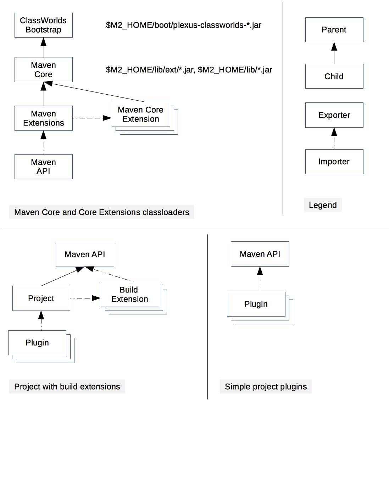

# Maven classloading



## ClassWorlds bootstrap classloader

This classloader is created and managed by the calling environment: JVM launcher, integration testing harness, etc.

During normal command line Maven invocation this is the JVM System classloader and contains classes from `${maven.home}/boot/plexus-classworlds-*.jar` and classes from `-javaagent`.

## Maven Core classloader

This classloader contains core Maven runtime classes like MavenProject, AsbtractMojo and so on. This is the classloader set as the "container realm" in the Plexus container instance unless Maven Extensions classloader is created (see below).

Contents of this classloader are configured in `${maven.home}/bin/m2.conf` and typically contains `${maven.home}/lib/ext/*.jar` and `${maven.home}/lib/*.jar`.

## Maven Core Extensions classloaders

Core Extensions is a new mechanism introduced in Maven 3.3.0 which allows additional components to be loaded into Maven Core as part of a build session.

Each core extension is loaded in a separate classloader and there is no mechanism to share classes among core extensions. Core extensions classloaders use Maven Core classloader as the parent and have access to both exported and internal Maven Core classes.

Core extension can use `META-INF/maven/extension.xml` descriptor to declare packages and artifacts exported by the extension. If the descriptor is not present, no packages or artifacts are exported, but the extension can still contribute components to Maven Core extension points.

Core extensions are configured in `${maven.projectBasedir}/.mvn/extensions.xml` configuration file.

```xml
<?xml version="1.0" encoding="UTF-8"?>
<extensions>
  <extension>
    <groupId>...</groupId>
    <artifactId>...</artifactId>
    <version>...</version>
  </extension>
  <extension>...</extension>
  ...
</extensions>
```

Core extensions are loaded as part of Maven runtime startup and disposed of as part of Maven runtime shutdown.

## Maven extensions classloader

Maven extensions classloader aggregates packages exported by core extensions realms. It also loads additional classpath entries specified in `-Dmaven.ext.class.path` command line parameter.

Maven extensions classloader is created only when core extensions are configured for the build. If created, it will be set as "container realm" in the Plexus container. 

## Maven API classloader

Maven API classloader aggregates exported packages from Maven Core and Maven Core Extensions classloaders. Maven API classloader does not include any classes directly.

Maven API uses approximate JVM Bootstrap classloader as its parent. (there is no API to access JVM Bootstrap classloader, implementation uses `ClassLoader.getSystemClassLoader().getParent()`). The parent classloader does not contain any application or javaagent classes, which allows for consistent Maven API classpath regardless how Maven JVM was launched.

## Build Extension classloaders

Modern Maven 3.x build extensions are build extensions that either consist of multiple artifacts or have `META-INF/maven/extension.xml`. Each modern build extension is loaded in a a fully isolated classloader, i.e. it is not possible to share classes or inject components among extensions.

Maven guarantees that each distinct modern build extension (as identified by plugin groupId, artifactId, version and set of dependecies) is loaded by one and only one extensions classloader and the classloader is wired to all projects that use the extension.

Build extension classloaders use ClassWorld bootstrap classloader as the parent, which allows build extensions access to `-javaagent` classes.

## Project classloaders

Project classloader aggregates Maven API packages, packages exported by project build extensions. 

Project classloaders use Maven API classloader as the parent and import exported classes from project build extension realms. Legacy Maven 2.x build extensions, i.e. extensions that consist of single artifact which does not include `META-INF/maven/extension.xml` descriptor, are directly in project classloaders.

Maven guarantees there will be one and only one project classloader for each unique set of project build extensions and the same classloader will be used by all projects that have the set of build extensions.

## Plugin classloaders

Plugin classloaders are wired differently for projects with and without build extensions.

For projects without build extensions, single classloader is created for each plugin identified by groupId:artifactId:version and the classloader imports API packages from Maven API classloader. Maven will create one and only one classloader for each unique plugin+dependency combination.

For projects that use build extensions, plugin classloaders are wired to project classloaders. This gives plugin code access to both Maven API packages and packages exported by the project build extensions. Maven will create one and only one classlaoder for each unique plugin+dependencies+build-extensions combination.

All plugin classloaders use ClassWorlds bootstrap classloader as the parent. This provides relatively clean and therefore consistent plugin classpath, while still allowing plugins access to `-javaagent` classes (see [MNG-4747](https://issues.apache.org/jira/browse/MNG-4747)).

Reporting plugins are wired differently still, but reporting plugins are a special case and are outside of the scope of this document.

## Exported artifacts and packages

Maven Core, Session and Build Extensions use `META-INF/maven/extension.xml` descriptor to declare API packages and artifacts exported by the classloader. 


```xml
<?xml version="1.0" encoding="UTF-8"?>
<extension>
 <!-- 
   | list of exported classname prefixes.
   -->
 <exportedPackages>
   <exportedPackage>org.something.myextension</exportedPackage>
 </exportedPackages>
     
 <!-- 
   | exported artifacts in groupId:artifactId format 
   -->
 <exportedArtifacts>
   <exportedArtifact>org.company:myextension</exportedArtifact>
 </exportedArtifacts>
</extension>
```
